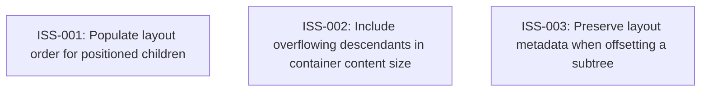

# Markdown Issue Index

Generated by derive-tracker.wasm

## Ready Queue

| ID | Priority | Type | Assignee | Title | Labels |
| --- | ---: | --- | --- | --- | --- |
| [ISS-003](ISS-003.md) | 0 | bug | unassigned | Preserve layout metadata when offsetting a subtree | tree, layout-metadata, relative-positioning, margin-collapse, regression, tests |
| [ISS-001](ISS-001.md) | 1 | bug | unassigned | Populate layout order for positioned children | tree, layout-metadata, upstream-parity, tests |
| [ISS-002](ISS-002.md) | 1 | bug | unassigned | Include overflowing descendants in container content size | tree, content-size, overflow, scrolling, upstream-parity, tests |

## Unresolved Issues

| ID | Status | Priority | Type | Assignee | Blocked by | Blocks | Title |
| --- | --- | ---: | --- | --- | --- | --- | --- |
| [ISS-003](ISS-003.md) | open | 0 | bug | unassigned | none | none | Preserve layout metadata when offsetting a subtree |
| [ISS-001](ISS-001.md) | open | 1 | bug | unassigned | none | none | Populate layout order for positioned children |
| [ISS-002](ISS-002.md) | open | 1 | bug | unassigned | none | none | Include overflowing descendants in container content size |

## Dependency Graph

## Warnings

None.
