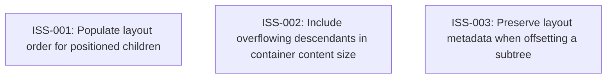

# Markdown Issue Index

Generated by derive-tracker.wasm

## Ready Queue

No ready issues.

## Unresolved Issues

| ID | Status | Priority | Type | Assignee | Blocked by | Blocks | Title |
| --- | --- | ---: | --- | --- | --- | --- | --- |
| [ISS-003](ISS-003.md) | in_progress | 0 | bug | unassigned | none | none | Preserve layout metadata when offsetting a subtree |
| [ISS-001](ISS-001.md) | in_progress | 1 | bug | unassigned | none | none | Populate layout order for positioned children |
| [ISS-002](ISS-002.md) | in_progress | 1 | bug | unassigned | none | none | Include overflowing descendants in container content size |

## Dependency Graph

## Warnings

None.
